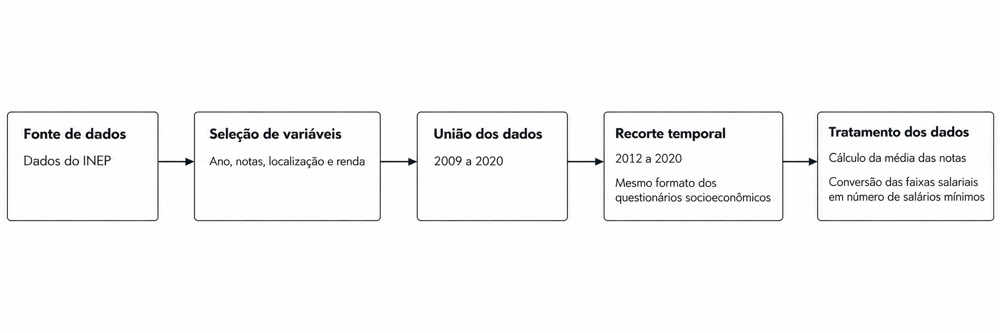

# Renda mensal e desempenho no ENEM

Este trabalho investiga a relação entre renda mensal e desempenho no Exame Nacional do Ensino Médio (ENEM). O objetivo é verificar se o aumento da faixa de renda está associado a maiores médias nas notas, por meio de análise de correlação e regressão linear.

## Dados

Foram utilizados os [microdados do ENEM disponibilizados pelo Instituto Nacional de Estudos e Pesquisas Educacionais Anísio Teixeira (Inep)](https://www.gov.br/inep/pt-br/acesso-a-informacao/dados-abertos/microdados/enem).

Inicialmente, foram reunidos os conjuntos de dados de 2009 a 2020. A análise foi delimitada ao período de **2012 a 2020**, por apresentar o mesmo padrão de questionário socioeconômico, permitindo a comparação das informações de renda entre os anos.

## Tratamento dos dados

A preparação dos dados compreendeu as seguintes etapas:

1. Seleção das colunas referentes ao ano, às notas, à localização e à renda.
2. União dos conjuntos de dados de 2009 a 2020.
3. Aplicação do recorte temporal de 2012 a 2020.
4. Cálculo das médias das notas.
5. Conversão das categorias de renda, originalmente identificadas por letras, em valores numéricos expressos em quantidade de salários, utilizando o valor central de cada faixa.

## Análise estatística

A análise foi orientada pelas seguintes hipóteses:

- **H₀ — hipótese nula:** o aumento da renda não está associado ao aumento da média das notas.
- **H₁ — hipótese alternativa:** o aumento da renda está associado ao aumento da média das notas.

Após a análise dos dados, foi calculado o coeficiente de correlação de Pearson para avaliar a relação linear entre renda e desempenho. Em seguida, foi ajustado um modelo de regressão linear, com obtenção do coeficiente estimado e do respectivo p-valor.

## Resultados

A regressão linear indicou um **aumento médio estimado de 9,32 pontos nas notas por aumento de faixa salarial**.

O p-valor obtido foi muito baixo, fornecendo evidências favoráveis à rejeição da hipótese nula. Os resultados apontam, portanto, uma associação positiva entre faixa de renda e média das notas no período analisado.

## Bibliotecas e módulos utilizados

- Matplotlib
- pandas
- NumPy
- glob
- statsmodels
- SciPy
